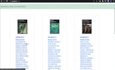

# Ecommerce React App

This is an Ecommerce develop in React

## Features

- Inventory management
- Dynamic categories from firebase 
- Stock validation on order fulfillment
- Cart persistent with Local Storage
- Order List


## Demo

A quick demo could be seen in here
https://ecommerce-zarate.vercel.app/


## Screenshots

Checkout process



Inventory management


## Run Locally

Clone the project

```bash
  git clone https://github.com/diegozaratean/ecommerce-zarate/
```

Go to the project directory

```bash
  cd my-project
```

Install dependencies

```bash
  npm install
```

Start the server

```bash
  npm start
```


## Environment Variables

To run this project, you will need to add the following environment variables to your .env file

`REACT_APP_FIREBASE_API_KEY`

`REACT_APP_AUTHDOMAIN`

`REACT_APP_FIREBASEPROJECTID`

`REACT_APP_STORAGEBUCKET`

`REACT_APP_MESSAGINGSENDERID`

`REACT_APP_APPID`

`REACT_APP_MESUREMENTEID`


## Appendix

The libraries use in this project:

react-bootstrap

fontawesome

firebase

react-toastify

react-number-format

